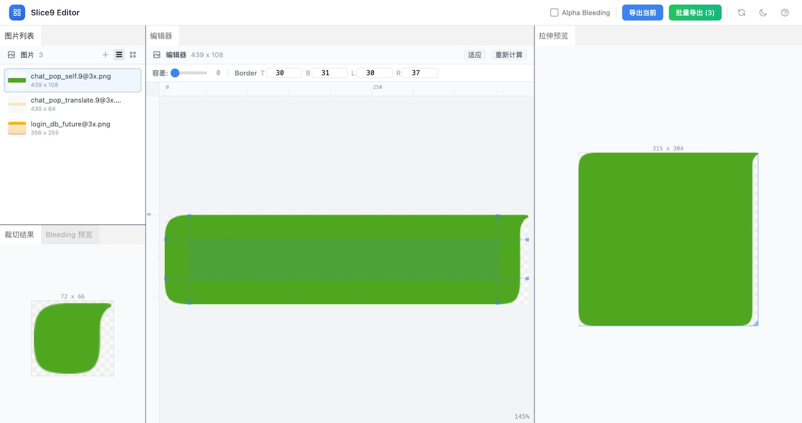

# Slice9 Editor

九宫格切图编辑器 — 将普通 PNG 图片转换为 `.9.png` 九宫格拉伸图片。



## 功能

- 自动检测可拉伸区域（基于像素相似度分析）
- 可视化编辑切片边界（拖拽 / 键盘微调 / 数值输入）
- 实时拉伸预览（可拖拽调整预览尺寸）
- 裁切结果预览
- Alpha Bleeding 预览（以 alpha=1 渲染，查看颜色扩散效果）
- 导出 `.9.png` + `border-config.json`
- 批量导出为 ZIP
- 暗色模式
- 可拖拽面板布局（基于 Dockview）

## 技术栈

- Vue 3 + TypeScript + Vite
- Tailwind CSS
- Dockview（面板布局）
- JSZip（批量打包）

## 开发

```bash
npm install
npm run dev
```

## 构建

```bash
npm run build
```
